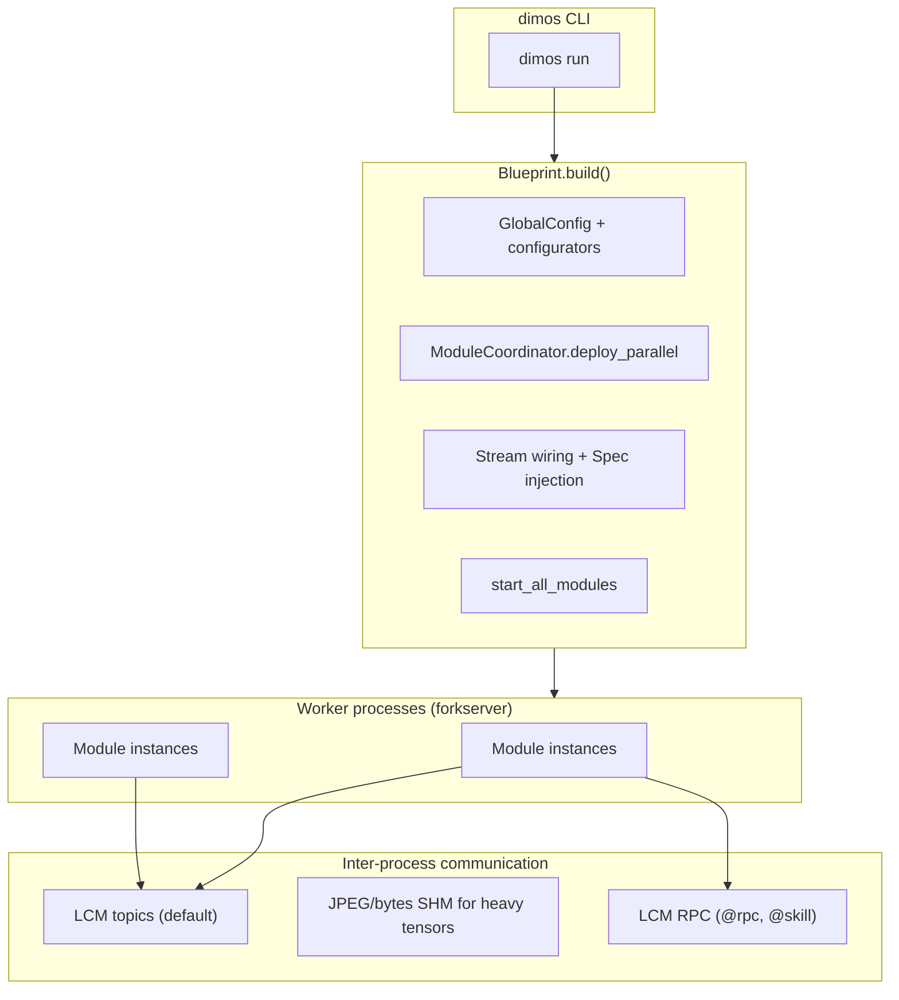
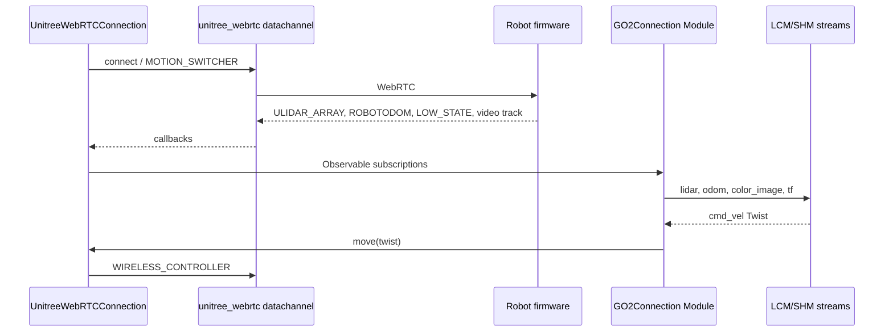

# DimOS — Comprehensive Learning Guide

This document maps the **dimos** repository (Dimensional’s agentic robotics framework): how it starts, how modules communicate, which robots are supported, and where algorithms live. It is written for a strong programmer who is new to both robotics and this codebase.

**Scope.** Analysis is based on the tree under `/dimos/dimos/`, `pyproject.toml`, `setup.py`, `uv.lock`, `README.md`, and `AGENTS.md`. Paths below are relative to the repository root unless stated otherwise.

**Uncertainty.** Where behavior is inferred from naming or optional extras only, this is marked **(uncertain)** or **(not verified in-tree)**.

**Deep dives:** §**14** Unitree WebRTC (connection, topics, skills), §**15** Manipulation (planning + coordinator), §**16** Drone (MAVLink, video, PID tracking).

---

## 1. System overview

### What this repo does

DimOS is a **Python-first modular robotics framework**: subsystems are `Module` classes with typed `In[T]` / `Out[T]` streams, composed into **blueprints** (`autoconnect`). Messages move over **LCM** (and optionally shared memory, ROS topics, or DDS) instead of requiring a full ROS install for the default path. **LLM agents** can call robot capabilities exposed as **MCP tools** (`@skill` methods) when an agentic blueprint includes `McpServer` + `McpClient`.

### Hardware targets and selection

There is **no compile-time robot switch**. Targeting is **runtime** via `GlobalConfig` and CLI flags (from `dimos/core/global_config.py`):

| Mechanism | Effect |
|-----------|--------|
| `simulation` / `--simulation` | `GlobalConfig.unitree_connection_type` → `"mujoco"` for Unitree stacks |
| `replay` / `--replay` | Connection type → `"replay"`; feeds recorded data |
| `robot_ip`, `robot_ips`, `xarm7_ip`, … | Network endpoints for real hardware |
| `mujoco_*` | Simulation room, camera, steps, start pose |
| Blueprint choice | Which modules are instantiated (e.g. `unitree-go2` vs `drone-basic`) |

See `GlobalConfig.unitree_connection_type` at ```73:79:dimos/core/global_config.py```.

### High-level architecture



ASCII variant:

```
[ dimos run ] → [ autoconnect(blueprints) ] → [ Blueprint.build ]
      → [ forkserver workers ] → [ deploy modules ] → [ wire In/Out + Spec refs ]
      → [ build() / start() per module ] → [ coordinator.loop() blocks ]
```

---

## 2. Repository structure

Annotated tree (only major folders; `docs/`, `data/`, `docker/`, `scripts/` exist alongside).

| Path | Role |
|------|------|
| `dimos/core/` | **Core OS**: `Module`, `Blueprint`, transports, workers, RPC, run registry, daemon |
| `dimos/protocol/` | LCM pub/sub, RPC, service configurators, TF |
| `dimos/msgs/` | Message types (geometry, sensor, nav, TF) — ROS-like but native |
| `dimos/robot/` | **Hardware blueprints**, Unitree (Go2, G1, B1), drone, CLI, blueprint registry |
| `dimos/hardware/` | Reusable drivers: cameras, lidar wrappers, manipulator mocks |
| `dimos/navigation/` | Planners (A*, frontier exploration), patrolling, bbox nav |
| `dimos/mapping/` | Occupancy, cost maps, voxels, OSM helpers, pointcloud → map |
| `dimos/perception/` | 2D/3D detection, spatial memory, experimental temporal memory |
| `dimos/agents/` | MCP server/client, skills, prompts, LangChain agent |
| `dimos/manipulation/` | Arms: planning (Pinocchio IK, RRT), control, coordinators |
| `dimos/control/` | Mobile manipulator / coordinator blueprints |
| `dimos/simulation/` | MuJoCo ONNX policies, Unity/Isaac/Genesis stubs |
| `dimos/visualization/` | Rerun bridge, Foxglove-related helpers |
| `dimos/memory/` / `dimos/memory2/` | Embedding / timeseries / blob store pipelines |
| `dimos/stream/` | Video/audio providers |
| `dimos/teleop/` | Quest, phone, keyboard teleop modules |
| `dimos/skills/` | Higher-level skill libraries (navigation, manipulation, REST) |
| `dimos/utils/` | Logging, math, CLI tools (`lcmspy`, `agentspy`, …) |
| `dimos/e2e_tests/` | Integration tests (often `slow` / hardware-adjacent) |
| `examples/` | Small interop demos (e.g. Lua/TS/C++) |

**Shared core** = `core/`, `protocol/`, `msgs/`, most `utils/`. **Hardware-specific** = `robot/unitree/`, `robot/drone/`, `hardware/`, `manipulation/`. **Simulation** = `simulation/`, plus `GlobalConfig.simulation`. **Tests** = `**/test_*.py` under `dimos/`.

---

## 3. Tech stack and libraries

Versions: **`pyproject.toml`** defines ranges; the resolved graph is in **`uv.lock`** (single source for exact pins in CI/dev). Below: **why** each dependency matters *in this repo*.

### Core runtime (`dependencies` in `pyproject.toml`)

| Package | Version hint | Role in DimOS |
|---------|----------------|-----------------|
| `dimos-lcm` | (pinned transitively) | LCM bindings used by pub/sub and RPC |
| `PyTurboJPEG` | 1.8.2 | Fast JPEG encode/decode for camera pipelines |
| `numpy` | ≥1.26.4 | Arrays for geometry, maps, policies, Pinocchio |
| `scipy` | ≥1.15.1 | Linear algebra helpers (e.g. IK solves) |
| `pin` | ≥3.3.0 | **Pinocchio** — FK, Jacobians, IK integration (`dimos/manipulation/planning/kinematics/pinocchio_ik.py`) |
| `reactivex` | — | Stream subscriptions in modules |
| `sortedcontainers` | 2.4.0 | Ordered structures in scheduling / collections |
| `pydantic` / `pydantic-settings` | — | `GlobalConfig`, module configs |
| `structlog`, `colorlog` | — | Structured logging |
| `opencv-python` | — | Image I/O and CV in perception and utils |
| `open3d` | platform-specific wheels | Voxel mapping, point cloud ops (`dimos/mapping/voxels.py`) |
| `numba` / `llvmlite` | — | JIT for occupancy / map hot paths |
| `typer`, `textual`, `plotext` | — | CLI and TUI (`dimos/robot/cli/dimos.py`, `dtop`, etc.) |
| `rerun-sdk`, `dimos-viewer` | — | Visualization (note: comment in `pyproject.toml` says rerun is currently hard-wired into core paths) |
| `protobuf` | — | Serialization in various bridges |
| `psutil` | — | Process and system introspection |
| `sqlite-vec` | — | Vector store integrations in memory pipelines |
| `lz4` | — | Compression in blob/codec paths |
| `toolz` | — | Functional helpers |
| `lazy_loader` | — | Lazy imports for heavy optional modules |
| `plum-dispatch` | 2.5.7 | Multiple dispatch patterns |
| `annotation-protocol` | — | Typing for protocols |

### Optional extras (install via `dimos[extra]`)

| Extra | Notable packages | Role |
|-------|------------------|------|
| `agents` | `langchain`, `langchain-openai`, `ollama`, … | LLM agent graphs, local models (`dimos/agents/mcp/mcp_client.py` uses `langchain.agents.create_agent`) |
| `perception` | `ultralytics`, `transformers`, `hydra-core`, `lap`, … | YOLO / VLMs / tracking stacks (**`filterpy` is listed but has no imports under `dimos/`** — reserved or legacy) |
| `manipulation` | `drake`, `xarm-python-sdk`, `piper-sdk`, `pyrealsense2`, … | Drake-based planning alternatives; real arms |
| `unitree` | `unitree-webrtc-connect-leshy` | WebRTC connection to Unitree robots |
| `sim` | `mujoco`, `playground`, `pygame` | MuJoCo sim and keyboard input |
| `drone` | `pymavlink` | MAVLink flight controller I/O |
| `dds` | `cyclonedds` | Optional DDS transport |
| `cuda` / `cpu` | `onnxruntime-gpu`, `cupy`, … | Accelerated inference where used |

### Native extensions

| Artifact | Build | Purpose |
|----------|-------|---------|
| `dimos.navigation.replanning_a_star.min_cost_astar_ext` | `setup.py` Pybind11 + `min_cost_astar_cpp.cpp` | Fast grid A* used when import succeeds; Python fallback in `min_cost_astar.py` |

Other C++: `dimos/hardware/sensors/lidar/fastlio2/cpp/` (FAST-LIO style processing), Livox sample `main.cpp`, B1 `joystick_server_udp.cpp` — **hardware or native bridge** code paths.

### Languages

- **Python**: almost all application logic.
- **C++**: A* extension, lidar/native modules, small examples (`examples/language-interop/cpp/`).

---

## 4. Execution flow — launch to control loop

### Step-by-step (CLI → running system)

1. **Entry point:** `dimos` console script → `dimos/robot/cli/dimos.py` → `main = typer.Typer(...)` ```37:40:dimos/robot/cli/dimos.py```.

2. **Global flags:** `@main.callback()` merges every `GlobalConfig` field into Typer options ```45:108:dimos/robot/cli/dimos.py```.

3. **`dimos run`:** ```111:166:dimos/robot/cli/dimos.py```
   - Loads `.env` via `load_dotenv()` ```42:42:dimos/robot/cli/dimos.py```
   - `global_config.update(**cli_config_overrides)` ```134:135:dimos/robot/cli/dimos.py```
   - Resolves blueprint: `autoconnect(*map(get_by_name, robot_types))` ```160:160:dimos/robot/cli/dimos.py```
   - `blueprint.build(cli_config_overrides=...)` → `ModuleCoordinator` ```166:166:dimos/robot/cli/dimos.py```

4. **`Blueprint.build`:** ```445:472:dimos/core/blueprints.py```
   - Updates `global_config` from blueprint + CLI
   - Runs **system configurators** (e.g. LCM / ulimits) `_run_configurators()` ```226:240:dimos/core/blueprints.py```
   - `ModuleCoordinator.start()` ```459:460:dimos/core/blueprints.py```
   - `_deploy_all_modules` — parallel deploy ```292:299:dimos/core/blueprints.py```
   - `_connect_streams` — assign `LCMTransport` / `pLCMTransport` per `(stream name, type)` ```301:327:dimos/core/blueprints.py```
   - `_connect_module_refs` — inject Spec RPC proxies ```329:443:dimos/core/blueprints.py```
   - `module_coordinator.build_all_modules()` then `start_all_modules()` ```467:468:dimos/core/blueprints.py```

5. **Workers:** `WorkerManager` starts `n_workers` processes using **forkserver** context ```44:52:dimos/core/worker_manager.py```; each module runs in a worker as an **Actor** proxy ```72:74:dimos/core/worker_manager.py```.

6. **Main thread blocks:** `coordinator.loop()` ```168:175:dimos/core/module_coordinator.py``` — waits on an event until interrupt, then `stop()` cleans up modules.

7. **Daemon mode:** optional double-fork + run registry (`dimos/core/daemon.py`, `RunEntry.save()` in `dimos run`).

### “Main control loop”

There is **no single RT thread** for all robots. Instead:

- Each **module** runs callbacks subscribed to streams (ReactiveX disposables) and/or RPC handlers.
- **Unitree low-level control** on hardware is delegated to the vendor SDK / sport modes over WebRTC (see skills in `dimos/robot/unitree/unitree_skill_container.py`).
- **MuJoCo sim** uses `mujoco.set_mjcb_control(policy.get_control)` in `dimos/simulation/mujoco/model.py` — ONNX policy runs on simulator stepping (**inference only**).

### Command path (example: Go2 navigation)

High-level intent → **LLM / MCP** (`McpClient`) → `@skill` RPC on skill container → **Navigator / connection** modules → **Twist or API** messages on LCM → robot firmware (off-repo).

Manipulation: **target pose** → RRT / IK (`dimos/manipulation/planning/`) → trajectory → joint or Cartesian controllers.

### Shutdown

`ModuleCoordinator.stop()` stops modules in reverse order ```70:85:dimos/core/module_coordinator.py```; `loop()` uses `finally: self.stop()` ```168:175:dimos/core/module_coordinator.py```.

---

## 5. Module deep dives (major subsystems)

This section summarizes **roles and interfaces**; every file is not expanded — see source for full IO.

### Core: `Module`, streams, RPC

- **`dimos/core/module.py`**: `ModuleBase` / `Module` — `In`/`Out` streams, `@rpc`, lifecycle, optional LangChain `@skill` exposure via `langchain_core.tools` import ```33:34:dimos/core/module.py```.
- **`dimos/core/rpc_client.py`** (not fully quoted): proxy for remote module in worker process.

### Blueprints

- **`dimos/core/blueprints.py`**: `Blueprint`, `autoconnect`, stream conflict detection, remappings.

### Transports

- **`dimos/core/transport.py`**: `LCMTransport`, `pLCMTransport`, `SHMTransport`, ROS, DDS gates — default LCM UDP multicast via `dimos.protocol.pubsub.impl.lcmpubsub`.

### Agents: MCP

- **`dimos/agents/mcp/mcp_server.py`**: HTTP MCP exposing `@skill` tools.
- **`dimos/agents/mcp/mcp_client.py`**: `McpClient` — fetches tools, builds LangChain `StructuredTool`, `create_agent(...)` ```183:188:dimos/agents/mcp/mcp_client.py```; runs agent in a **daemon thread** ```71:75:dimos/agents/mcp/mcp_client.py```.

### Navigation

- **`dimos/navigation/replanning_a_star/min_cost_astar.py`**: `min_cost_astar(costmap, goal, start, ...)` ```124:132:dimos/navigation/replanning_a_star/min_cost_astar.py``` — grid search with octile heuristic ```54:59:dimos/navigation/replanning_a_star/min_cost_astar.py```.
- **`dimos/navigation/replanning_a_star/module.py`**: `ReplanningAStarPlanner` module wiring planner to streams.
- **`dimos/navigation/frontier_exploration/wavefront_frontier_goal_selector.py`**: wavefront frontier exploration; uses `simple_inflate` from occupancy ```36:36:dimos/navigation/frontier_exploration/wavefront_frontier_goal_selector.py```.

### Mapping

- **`dimos/mapping/voxels.py`**: `VoxelGridMapper` — Open3D `VoxelBlockGrid` for volumetric mapping.
- **`dimos/mapping/occupancy/`**: inflation, gradients, path masks — used for safety and planning.

### Perception

- **`dimos/perception/detection/`**: 2D/3D detection modules, YOLO wrappers under `detectors/`.

### Manipulation

- **`dimos/manipulation/planning/kinematics/pinocchio_ik.py`**: `PinocchioIK.solve(target_pose, q_init, ...)` ```156:161:dimos/manipulation/planning/kinematics/pinocchio_ik.py``` — damped least squares on se(3) error ```176:194:dimos/manipulation/planning/kinematics/pinocchio_ik.py```.
- **`dimos/manipulation/planning/planners/rrt_planner.py`**: `RRTConnectPlanner` — bi-directional RRT-Connect ```61:89:dimos/manipulation/planning/planners/rrt_planner.py```.

### Unitree

- **`dimos/robot/unitree/unitree_skill_container.py`**: `@skill` methods calling `GO2ConnectionSpec` / sport APIs; lists `UNITREE_WEBRTC_CONTROLS` ```38:37:dimos/robot/unitree/unitree_skill_container.py``` (file continues with RTC topic usage).

### Drone

- **`dimos/robot/drone/connection_module.py`**: MAVLink connection and status.
- **`dimos/robot/drone/drone_visual_servoing_controller.py`**: PID visual servo ```19:44:dimos/robot/drone/drone_visual_servoing_controller.py```.

### Simulation

- **`dimos/simulation/mujoco/policy.py`**: `OnnxController.get_control` — steps policy every `n_substeps`, sets `data.ctrl` ```65:72:dimos/simulation/mujoco/policy.py```; `Go1OnnxController.get_obs` builds observation vector ```79:97:dimos/simulation/mujoco/policy.py```.

---

## 6. How parallel hardware targets differ

### Shared

- `Module` / `Blueprint` / transports / msgs.
- Navigation stack (costmap, A*) for ground robots using `OccupancyGrid`.
- Agent layer (MCP) when included.

### Unitree quadruped (Go2)

- Connection: **WebRTC** when not sim/replay (`GlobalConfig.unitree_connection_type` ```73:79:dimos/core/global_config.py```).
- Skills: `unitree_skill_container.py` — sport commands, gait, stand, etc.
- Blueprints: `dimos/robot/unitree/go2/blueprints/`.

### Unitree humanoid (G1)

- Separate connection modules under `dimos/robot/unitree/g1/`.
- Sim blueprints swap MuJoCo + ONNX policy (`G1OnnxController` in `simulation/mujoco/policy.py`).

### Manipulation arms (xArm, Piper)

- `dimos/hardware/manipulators/`, `dimos/robot/manipulators/`, `dimos/manipulation/` — SDKs gated by `[manipulation]` extra.

### Drone (MAVLink / DJI camera path)

- `dimos/robot/drone/` — MAVLink `pymavlink`, separate camera/tracking modules; PID tracking ```43:44:dimos/robot/drone/drone_tracking_module.py``` for indoor/outdoor gains.

### Side-by-side (simplified)

| Aspect | Go2 (real) | Go2 (sim) | G1 (sim) | Drone |
|--------|------------|-----------|----------|-------|
| Connection | WebRTC | MuJoCo + ONNX | MuJoCo + ONNX | MAVLink |
| High-level agent | MCP + skills | Same blueprint family | Same | `drone-agentic` |
| Low-level control | Vendor sport API | RL policy ONNX | RL policy ONNX | PID + MAVLink cmds |

### Where branching happens

- **Config:** `global_config.py` and CLI.
- **Blueprints:** `dimos/robot/all_blueprints.py` (auto-generated) lists string entry points ```18:97:dimos/robot/all_blueprints.py```.
- **Per-robot packages:** `dimos/robot/unitree/go2/`, `g1/`, `drone/`.

---

## 7. Algorithms

For each: **name**, **location**, **idea**, **math**, **variables**, **pseudocode**, **implementation notes**, **alternatives**.

### 7.1 Grid A* with cumulative cell cost (min-cost A*)

- **Implementation:** `min_cost_astar()` in `dimos/navigation/replanning_a_star/min_cost_astar.py` (Python) and `min_cost_astar_cpp()` in `dimos/navigation/replanning_a_star/min_cost_astar_cpp.cpp` (C++).
- **Intuition:** Find a path on a 2D grid minimizing a combination of **traversal distance** and **occupancy/cost** of cells; unknown cells get a penalty.

**Heuristic (octile distance)** for 8-connected grids:

```math
h(x,y) = (dx + dy) + (\sqrt{2} - 2)\min(dx, dy)
```

with \(dx = |x_g - x|\), \(dy = |y_g - y|\) — see `_heuristic` ```54:59:dimos/navigation/replanning_a_star/min_cost_astar.py```.

**Neighbor expansion:** 8 directions; movement costs `_sc=1`, `_dc≈√2` ```48:51:dimos/navigation/replanning_a_star/min_cost_astar.py```.

**Pseudocode:**

```
open ← priority queue with start
while open not empty:
  pop node with best (cost + heuristic)
  if node == goal: reconstruct path
  for each neighbor within map and below cost_threshold:
    tentative_cost = cost[current] + cell_cost(neighbor)
    if better than known: update, push
```

**Edge cases:** Goal outside grid → `None` ```139:140:dimos/navigation/replanning_a_star/min_cost_astar.py```; `UNKNOWN` cells scaled by `unknown_penalty` ```200:203:dimos/navigation/replanning_a_star/min_cost_astar.py```.

**Why A*:** Standard for occupancy grids; C++ extension for hot paths.

### 7.2 Wavefront frontier exploration

- **Implementation:** `dimos/navigation/frontier_exploration/wavefront_frontier_goal_selector.py` — BFS-style wavefront with point classification flags ```46:53:dimos/navigation/frontier_exploration/wavefront_frontier_goal_selector.py```.

**Intuition:** Label cells as open/closed/frontier; pick exploration goals at **boundaries between known free and unknown** space.

**Why:** Systematic coverage for autonomous mapping; pairs with SLAM / occupancy updates.

### 7.3 Occupancy inflation

- **Implementation:** `simple_inflate` imported in wavefront module ```36:36:dimos/navigation/frontier_exploration/wavefront_frontier_goal_selector.py``` from `dimos/mapping/occupancy/inflation.py`.

**Intuition:** Dilate obstacles by robot radius for collision checking.

### 7.4 Jacobian IK (damped least squares on \(\mathrm{se}(3)\))

- **Implementation:** `PinocchioIK.solve()` ```156:196:dimos/manipulation/planning/kinematics/pinocchio_ik.py```.

**Error:** \(\xi = \log(\mathbf{T}_{ee}^{-1} \mathbf{T}_{goal}) \in \mathbb{R}^6\).

**Update:** With Jacobian \(\mathbf{J}\), solve \(\Delta q = -\mathbf{J}^\top (\mathbf{J}\mathbf{J}^\top + \lambda \mathbf{I})^{-1} \xi\) (damped least squares — see ```185:187:dimos/manipulation/planning/kinematics/pinocchio_ik.py```).

**Variables:** \(q\) joint angles; \(\lambda\) damping `cfg.damp`; step `cfg.dt`.

**Edge cases:** Velocity clamp near singularities ```189:192:dimos/manipulation/planning/kinematics/pinocchio_ik.py```.

**Alternatives:** Analytical IK (robot-specific), quadratic programming — not primary here.

### 7.5 RRT-Connect

- **Implementation:** `RRTConnectPlanner` ```61:89:dimos/manipulation/planning/planners/rrt_planner.py```.

**Intuition:** Grow two random trees from start and goal; connect when a bridge segment is collision-free.

**Use:** High-DOF arm motion when Drake or collision world is available (factory wiring in `dimos/manipulation/planning/factory.py`).

### 7.6 PID control

- **Implementation:** `PIDController` in `dimos/utils/simple_controller.py` — used by drone visual servoing and other controllers.

**Form:** Standard \(u = K_p e + K_i \int e + K_d \dot{e}\) with anti-windup (see class docstring ```60:60:dimos/utils/simple_controller.py```).

**Drone:** `DroneVisualServoingController` ```42:44:dimos/robot/drone/drone_visual_servoing_controller.py```.

### 7.7 ONNX RL policy inference (MuJoCo)

- **Implementation:** `OnnxController.get_control` ```65:72:dimos/simulation/mujoco/policy.py```.

**Intuition:** Observations (IMU-like, joints, last action, user command) → neural net → torques/positions.

**Important:** This repo contains **runtime inference** only. **Training pipeline, reward design, and export** are **not implemented in-tree**; policies are expected as `.onnx` assets (see `model.py` policy paths). **(uncertain)** Training likely happens in an external project (e.g. MuJoCo Playground / internal RL stack).

### 7.8 FAST-LIO2 / LiDAR SLAM (native)

- **Implementation:** `dimos/hardware/sensors/lidar/fastlio2/` (Python module + C++ `main.cpp`).

**Intuition:** Iterated Kalman filtering on LiDAR odometry — standard FAST-LIO family (**verify paper equations against upstream FAST-LIO2** if you need exact match).

### 7.9 2D object detection (YOLO / YOLOE)

- **Implementation:** `dimos/perception/detection/detectors/yolo.py`, `yoloe.py` — `ultralytics` models.

### 7.10 VLM / captioning

- **Implementation:** `dimos/models/vl/` — depends on optional stacks in `[misc]` / `agents`.

---

## 8. Data flow and communication

### LCM topics

- Streams default to **string topics** `/{name}` or hashed short id when names collide ```204:207:dimos/core/blueprints.py```.
- Encoding: typed LCM when `stream_type.lcm_encode` exists; else **PickleLCM** (`pLCMTransport`) ```204:207:dimos/core/blueprints.py```.

### Shared memory

- `JpegSharedMemory`, `BytesSharedMemory`, `PickleSharedMemory` in `dimos/core/transport.py` imports — used for **large images/point clouds** when blueprint wires SHM transports.

### RPC

- `LCMRPC` default on modules ```84:87:dimos/core/module.py``` — JSON-RPC-like calls over LCM for `@rpc` / `@skill`.

### ROS

- `ROSTransport` optional — bridge to ROS nodes without being the default stack (`AGENTS.md`).

### DDS

- Optional when `cyclonedds` installed (`DDS_AVAILABLE` in `transport.py`).

### TF

- `LCMTF` default in `ModuleConfig` ```88:88:dimos/core/module.py``` for coordinate transforms.

### Timing / frequency

- **Not centrally scheduled:** each module’s subscriptions define effective rate (sensor publish rate, sim step, timer in module). **No hard real-time guarantee** in the Python layer — **(design fact)**.

---

## 9. Configuration and parameters

### Primary config surface

- **`GlobalConfig`** (`dimos/core/global_config.py`) — fields include `robot_ip`, `simulation`, `replay`, `replay_dir`, `viewer`, `n_workers`, `mcp_port`, `mujoco_*`, `obstacle_avoidance`, `detection_model`, … ```29:58:dimos/core/global_config.py```.
- **Environment:** `.env` file + `DIMOS_*` style overrides via pydantic-settings ```60:64:dimos/core/global_config.py```.
- **CLI:** Every `GlobalConfig` field exposed as Typer option in `dimos run` callback ```53:97:dimos/robot/cli/dimos.py```.

### Robot / vendor YAML

- Unitree WebRTC params may ship under `dimos/robot/unitree_webrtc.params` (package data in `pyproject.toml`).

### Blueprint-specific kwargs

- Passed via `.blueprint(...)` in each module’s factory — see individual blueprint files.

---

## 10. Tests

**Runner:** `uv run pytest` (default excludes `slow`, `tool`, `mujoco` per `pyproject.toml` `[tool.pytest.ini_options]`).

**Markers:** `@pytest.mark.slow`, `@pytest.mark.mujoco`, etc. — see `docs/development/testing.md`.

### Inventory (156 files)

Every file matching `dimos/**/test_*.py` (includes deprecated package):

```
dimos/agents/mcp/test_mcp_client.py
dimos/agents/mcp/test_mcp_client_unit.py
dimos/agents/mcp/test_mcp_server.py
dimos/agents/skills/test_google_maps_skill_container.py
dimos/agents/skills/test_gps_nav_skills.py
dimos/agents/skills/test_navigation.py
dimos/agents/skills/test_unitree_skill_container.py
dimos/agents_deprecated/memory/test_image_embedding.py
dimos/control/test_control.py
dimos/core/test_blueprints.py
dimos/core/test_cli_stop_status.py
dimos/core/test_core.py
dimos/core/test_daemon.py
dimos/core/test_e2e_daemon.py
dimos/core/test_global_config.py
dimos/core/test_mcp_integration.py
dimos/core/test_modules.py
dimos/core/test_native_module.py
dimos/core/test_per_run_logs.py
dimos/core/test_rpcstress.py
dimos/core/test_stream.py
dimos/core/test_worker.py
dimos/core/tests/test_docker_deployment.py
dimos/core/tests/test_parallel_deploy_cleanup.py
dimos/e2e_tests/test_control_coordinator.py
dimos/e2e_tests/test_dimos_cli_e2e.py
dimos/e2e_tests/test_patrol_and_follow.py
dimos/e2e_tests/test_person_follow.py
dimos/e2e_tests/test_scan_and_follow_person.py
dimos/e2e_tests/test_spatial_memory.py
dimos/hardware/sensors/camera/zed/test_zed.py
dimos/manipulation/test_manipulation_module.py
dimos/manipulation/test_manipulation_unit.py
dimos/mapping/google_maps/test_google_maps.py
dimos/mapping/occupancy/test_extrude_occupancy.py
dimos/mapping/occupancy/test_gradient.py
dimos/mapping/occupancy/test_inflation.py
dimos/mapping/occupancy/test_operations.py
dimos/mapping/occupancy/test_path_map.py
dimos/mapping/occupancy/test_path_mask.py
dimos/mapping/occupancy/test_path_resampling.py
dimos/mapping/occupancy/test_visualizations.py
dimos/mapping/osm/test_osm.py
dimos/mapping/pointclouds/test_occupancy.py
dimos/mapping/pointclouds/test_occupancy_speed.py
dimos/mapping/test_voxels.py
dimos/memory/test_embedding.py
dimos/memory/timeseries/test_base.py
dimos/memory/timeseries/test_legacy.py
dimos/memory2/blobstore/test_blobstore.py
dimos/memory2/codecs/test_codecs.py
dimos/memory2/test_blobstore_integration.py
dimos/memory2/test_buffer.py
dimos/memory2/test_e2e.py
dimos/memory2/test_e2e_processing.py
dimos/memory2/test_embedding.py
dimos/memory2/test_registry.py
dimos/memory2/test_save.py
dimos/memory2/test_store.py
dimos/memory2/test_stream.py
dimos/memory2/test_visualizer.py
dimos/models/embedding/test_embedding.py
dimos/models/test_base.py
dimos/models/vl/test_base.py
dimos/models/vl/test_captioner.py
dimos/models/vl/test_vlm.py
dimos/msgs/geometry_msgs/test_PointStamped.py
dimos/msgs/geometry_msgs/test_Pose.py
dimos/msgs/geometry_msgs/test_PoseStamped.py
dimos/msgs/geometry_msgs/test_PoseWithCovariance.py
dimos/msgs/geometry_msgs/test_PoseWithCovarianceStamped.py
dimos/msgs/geometry_msgs/test_publish.py
dimos/msgs/geometry_msgs/test_Quaternion.py
dimos/msgs/geometry_msgs/test_Transform.py
dimos/msgs/geometry_msgs/test_Twist.py
dimos/msgs/geometry_msgs/test_TwistStamped.py
dimos/msgs/geometry_msgs/test_TwistWithCovariance.py
dimos/msgs/geometry_msgs/test_TwistWithCovarianceStamped.py
dimos/msgs/geometry_msgs/test_Vector3.py
dimos/msgs/nav_msgs/test_OccupancyGrid.py
dimos/msgs/nav_msgs/test_Odometry.py
dimos/msgs/nav_msgs/test_Path.py
dimos/msgs/sensor_msgs/test_CameraInfo.py
dimos/msgs/sensor_msgs/test_image.py
dimos/msgs/sensor_msgs/test_Joy.py
dimos/msgs/sensor_msgs/test_PointCloud2.py
dimos/msgs/std_msgs/test_header.py
dimos/msgs/tf2_msgs/test_TFMessage.py
dimos/msgs/tf2_msgs/test_TFMessage_lcmpub.py
dimos/navigation/frontier_exploration/test_wavefront_frontier_goal_selector.py
dimos/navigation/patrolling/test_create_patrol_router.py
dimos/navigation/replanning_a_star/test_goal_validator.py
dimos/navigation/replanning_a_star/test_min_cost_astar.py
dimos/perception/detection/detectors/person/test_person_detectors.py
dimos/perception/detection/detectors/test_bbox_detectors.py
dimos/perception/detection/reid/test_embedding_id_system.py
dimos/perception/detection/reid/test_module.py
dimos/perception/detection/type/detection2d/test_bbox.py
dimos/perception/detection/type/detection2d/test_imageDetections2D.py
dimos/perception/detection/type/detection2d/test_person.py
dimos/perception/detection/type/detection3d/test_imageDetections3DPC.py
dimos/perception/detection/type/detection3d/test_pointcloud.py
dimos/perception/detection/type/test_detection3d.py
dimos/perception/detection/type/test_object3d.py
dimos/perception/experimental/temporal_memory/test_temporal_memory_module.py
dimos/perception/test_spatial_memory.py
dimos/perception/test_spatial_memory_module.py
dimos/protocol/pubsub/benchmark/test_benchmark.py
dimos/protocol/pubsub/impl/test_lcmpubsub.py
dimos/protocol/pubsub/impl/test_rospubsub.py
dimos/protocol/pubsub/test_encoder.py
dimos/protocol/pubsub/test_pattern_sub.py
dimos/protocol/pubsub/test_patterns.py
dimos/protocol/pubsub/test_spec.py
dimos/protocol/rpc/test_lcmrpc.py
dimos/protocol/rpc/test_rpc_utils.py
dimos/protocol/rpc/test_spec.py
dimos/protocol/service/test_lcmservice.py
dimos/protocol/service/test_spec.py
dimos/protocol/service/test_system_configurator.py
dimos/protocol/tf/test_tf.py
dimos/robot/cli/test_cli_startup.py
dimos/robot/drone/test_drone.py
dimos/robot/test_all_blueprints.py
dimos/robot/test_all_blueprints_generation.py
dimos/robot/unitree/b1/test_connection.py
dimos/robot/unitree/testing/test_actors.py
dimos/robot/unitree/testing/test_tooling.py
dimos/robot/unitree/type/test_lidar.py
dimos/robot/unitree/type/test_odometry.py
dimos/robot/unitree/type/test_timeseries.py
dimos/simulation/manipulators/test_sim_adapter.py
dimos/simulation/unity/test_unity_sim.py
dimos/spec/test_utils.py
dimos/test_no_init_files.py
dimos/test_no_sections.py
dimos/types/test_timestamped.py
dimos/types/test_vector.py
dimos/types/test_weaklist.py
dimos/utils/cli/lcmspy/test_lcmspy.py
dimos/utils/decorators/test_decorators.py
dimos/utils/docs/test_doclinks.py
dimos/utils/test_ament_prefix.py
dimos/utils/test_data.py
dimos/utils/test_foxglove_bridge.py
dimos/utils/test_generic.py
dimos/utils/test_llm_utils.py
dimos/utils/test_reactive.py
dimos/utils/test_transform_utils.py
dimos/utils/test_trigonometry.py
dimos/utils/testing/test_moment.py
dimos/utils/testing/test_replay.py
dimos/visualization/rerun/test_viewer_integration.py
```

### Grouped purpose (abbrev.)

| Area | Pass criteria (typical) |
|------|-------------------------|
| `msgs/*` | Serialization round-trip, LCM publish smoke |
| `protocol/*` | Pub/sub and RPC contracts |
| `navigation/replanning_a_star` | Path validity vs known grids |
| `mapping/occupancy` | Geometric ops invariants |
| `core/*` | Workers, blueprints, daemon, MCP wiring |
| `e2e_tests` | Multi-module scenarios (**often slow**) |
| `robot/test_all_blueprints*` | Registry importability / generation sync |
| `perception/*` | Detection types, embedding consistency |

**Hardware-in-the-loop:** Most tests are **pure software**. LiDAR / Zed / real arms require devices and are usually gated.

---

## 11. Simulation interface

### Abstraction

- `GlobalConfig.simulation` selects **MuJoCo** connection path for Unitree (`unitree_connection_type == "mujoco"`).

### Physics

- **MuJoCo** (`mujoco` package, `[sim]` extra) — `dimos/simulation/mujoco/model.py` loads scene and ONNX policy.

### Fidelity

- Contact, sensors, and actuation depend on MJCF assets under `data/mujoco_sim/` — **not identical** to real Unitree firmware.

### What sim does not capture

- Wireless latency, motor saturation quirks, battery, uneven terrain physics mismatch — **expected sim-to-real gap**.

### Other backends

- `simulation/unity/`, `simulation/isaac/`, `simulation/genesis/` — integration stubs; **read each module before relying on them**.

---

## 12. Patterns, idioms, gotchas

| Pattern | Where |
|---------|-------|
| **Blueprint composition** | `autoconnect` merges streams by `(name, type)` |
| **Spec injection** | Annotate `_navigator: NavigatorSpec`; blueprint resolves implementation |
| **Forkserver workers** | Avoid fork after threads; modules run isolated |
| **Optional C++ A*** | Import failure → Python fallback (log warning) |
| **Disabled modules** | `.disabled_modules()` → no-op proxies with warnings ```49:58:dimos/core/blueprints.py``` |

**Gotchas**

- `all_blueprints.py` is **auto-generated** — run `pytest dimos/robot/test_all_blueprints_generation.py` after adding blueprints (`AGENTS.md`).
- **Rerun** currently treated as near-mandatory in some paths (`pyproject.toml` comment).
- **`filterpy`** listed under `[perception]` but **no usage** found in `dimos/**/*.py` — may be unused or planned.
- **LangChain / OpenAI** keys required for cloud agent blueprints.

**TODOs:** Transport layer refactor notes in `dimos/core/transport.py` ```45:63:dimos/core/transport.py```.

---

## 13. Glossary

| Term | Meaning |
|------|---------|
| **LCM** | Lightweight Communications Library — multicast pub/sub used as default transport |
| **Blueprint** | Declarative bundle of module types + kwargs + optional remappings |
| **Module** | Addressable unit with streams and RPC; may run in worker process |
| **In / Out** | Typed publish/subscribe endpoints on a module |
| **Spec** | Protocol type for dependency injection between modules |
| **MCP** | Model Context Protocol — HTTP JSON-RPC for tool listing/calling (`/mcp`) |
| **@skill** | Decorator exposing an RPC method to the LLM as a tool |
| **OccupancyGrid** | 2D grid map with per-cell cost / unknown / inflated obstacles |
| **Costmap** | Grid used for planning (may combine occupancy + distance transform) |
| **Frontier** | Boundary between known free space and unknown regions |
| **ONNX policy** | Exported neural network for locomotion inference in MuJoCo |
| **WebRTC (Unitree)** | Vendor connection path for video/state/control topics |
| **MAVLink** | Drone telemetry/command protocol |
| **SHM** | Shared memory transport for large messages |
| **TF** | Transform tree between coordinate frames |
| **Drake** | Optional motion planning backend when `[manipulation]` installs it |

---

## 14. Phase 1 — Unitree WebRTC (deep dive)

This section traces **real-hardware** Unitree control and sensing: the `unitree-webrtc-connect-leshy` dependency (`pyproject.toml` `[unitree]` extra), DimOS wrappers, and how streams reach the rest of the stack.

### 14.1 External library and responsibility split

| Layer | Package / module | Role |
|--------|------------------|------|
| Vendor WebRTC + datachannel | `unitree_webrtc_connect` (`webrtc_driver`, `constants`) | Connect to robot at IP, datachannel pub/sub, video track |
| DimOS adapter | `dimos/robot/unitree/connection.py` — `UnitreeWebRTCConnection` | Asyncio thread, topic subscriptions as Rx Observables, `move()`, sport APIs |
| Robot module | `GO2Connection` (`dimos/robot/unitree/go2/connection.py`) | Subscribes lidar/odom/video → DimOS streams; `cmd_vel` → `move()`; exposes `publish_request` |
| Humanoid | `G1Connection` (`dimos/robot/unitree/g1/connection.py`) | When `connection_type == "webrtc"`, holds same `UnitreeWebRTCConnection` |

`RTC_TOPIC`, `SPORT_CMD`, `VUI_COLOR` are imported from `unitree_webrtc_connect.constants` in ```27:30:dimos/robot/unitree/connection.py```.

### 14.2 Connection establishment (`UnitreeWebRTCConnection.__init__` / `connect`)

Signature-style API:

```python
def __init__(self, ip: str, mode: str = "ai") -> None
def connect(self) -> None
```

Behavior ```80:119:dimos/robot/unitree/connection.py```:

1. Constructs `LegionConnection(WebRTCConnectionMethod.LocalSTA, ip=self.ip)` — **LocalSTA** = robot on local Wi‑Fi STA mode ```86:86:dimos/robot/unitree/connection.py```.
2. Spawns a **daemon thread** with a **fresh asyncio event loop** ```116:118:dimos/robot/unitree/connection.py```.
3. `async_connect()` runs on that loop: `await self.conn.connect()`, disables traffic saving, sets **native** video decoder ```99:99:dimos/robot/unitree/connection.py```.
4. Publishes **motion switcher** request: `RTC_TOPIC["MOTION_SWITCHER"]` with `api_id: 1002` and `parameter: {"name": self.mode}` (default `"ai"`) ```101:103:dimos/robot/unitree/connection.py```.
5. Blocks constructor until `connection_ready` is set ```119:119:dimos/robot/unitree/connection.py```.

**Shutdown** ```124:150:dimos/robot/unitree/connection.py```: zeros `WIRELESS_CONTROLLER` sticks, `disconnect()`, stops loop, joins thread.

### 14.3 RTC topics used in DimOS (subscriber streams)

| Stream method | `RTC_TOPIC[...]` key | DimOS output / type |
|---------------|----------------------|---------------------|
| `raw_lidar_stream` | `ULIDAR_ARRAY` | `Observable[RawLidarMsg]` → mapped to `PointCloud2` via `pointcloud2_from_webrtc_lidar` ```238:248:dimos/robot/unitree/connection.py``` |
| `raw_odom_stream` | `ROBOTODOM` | `Pose` → `Odometry.from_msg` ```243:257:dimos/robot/unitree/connection.py``` |
| `lowstate_stream` | `LOW_STATE` | `LowStateMsg` ```276:277:dimos/robot/unitree/connection.py``` |
| Video | (aiortc track, not RTC_TOPIC string) | `raw_video_stream` / `video_stream` → `Image` ```321:273:dimos/robot/unitree/connection.py``` |

Subscription pattern: `unitree_sub_stream(topic_name)` wraps `datachannel.pub_sub.subscribe` on the **same asyncio loop** via `loop.call_soon_threadsafe` ```209:228:dimos/robot/unitree/connection.py```.

### 14.4 Velocity commands: `move` and joystick mapping

```python
def move(self, twist: Twist, duration: float = 0.0) -> bool
```

`Twist` fields use the in-file convention ```162:167:dimos/robot/unitree/connection.py```: `linear.x` = right/left, `linear.y` = forward/back, `angular.z` = yaw rate. The datachannel payload is:

`{"lx": -twist.linear.y, "ly": twist.linear.x, "rx": -twist.angular.z, "ry": 0}` ```169:171:dimos/robot/unitree/connection.py```

So **forward** velocity maps to **`lx`** (negated), **lateral** to **`ly`**, **yaw** to **`rx`** (negated).

Published on `RTC_TOPIC["WIRELESS_CONTROLLER"]`.

A **threading.Timer** (`cmd_vel_timeout` default **0.2 s**) auto-stops motion; for `duration > 0`, a tight loop re-sends commands every 10 ms ```174:198:dimos/robot/unitree/connection.py```.

### 14.5 Sport / API requests (request–response)

```python
def publish_request(self, topic: str, data: dict[Any, Any]) -> Any
```

Implemented as `asyncio.run_coroutine_threadsafe(..., self.loop)` around `publish_request_new` ```232:236:dimos/robot/unitree/connection.py```.

Examples in the same class:

- `standup()` → `RTC_TOPIC["SPORT_MOD"]` + `SPORT_CMD["StandUp"]` ```279:280:dimos/robot/unitree/connection.py```
- `balance_stand()` — enables joystick locomotion ```282:286:dimos/robot/unitree/connection.py```
- `free_walk()` ```294:296:dimos/robot/unitree/connection.py```
- `set_obstacle_avoidance` → `RTC_TOPIC["OBSTACLES_AVOID"]` ```288:292:dimos/robot/unitree/connection.py```
- `color()` → `RTC_TOPIC["VUI"]` ```309:318:dimos/robot/unitree/connection.py```

### 14.6 GO2 module wiring (`GO2Connection`)

**Factory** `make_connection(ip, cfg)` ```96:108:dimos/robot/unitree/go2/connection.py```:

| Condition | Implementation |
|-----------|----------------|
| `ip` in `fake`/`mock`/`replay` or `unitree_connection_type == "replay"` | `ReplayConnection` (dataset `replay_dir`) |
| `ip == "mujoco"` or type `mujoco` | `MujocoConnection` |
| Else | `UnitreeWebRTCConnection(ip)` |

`GO2Connection.start()` ```229:254:dimos/robot/unitree/go2/connection.py```:

- Pipes `lidar_stream` → `lidar`, `odom_stream` → TF + `odom`, `video_stream` → `color_image`.
- Subscribes `cmd_vel` → `move`.
- Calls `standup()`, sleep, `balance_stand()`, `set_obstacle_avoidance(global_config.obstacle_avoidance)`.

`publish_request` is forwarded for skills ```320:329:dimos/robot/unitree/go2/connection.py```.

**Spec for skills:** `GO2ConnectionSpec` requires `publish_request(topic, data)` ```20:21:dimos/robot/unitree/go2/connection_spec.py```.

### 14.7 G1 real robot (`G1Connection`)

Only **`webrtc`** is implemented for hardware; `replay` / `mujoco` on this class raise and direct you to other modules ```80:90:dimos/robot/unitree/g1/connection.py```.

```python
def move(self, twist: Twist, duration: float = 0.0) -> None
def publish_request(self, topic: str, data: dict[str, Any]) -> dict[Any, Any]
```

Subscribes `cmd_vel` → `move` ```95:95:dimos/robot/unitree/g1/connection.py```.

### 14.8 Agent skills → WebRTC (`UnitreeSkillContainer`)

- `execute_sport_command(command_name)` resolves names via `_UNITREE_COMMANDS` and calls `publish_request(RTC_TOPIC["SPORT_MOD"], {"api_id": id_})` ```287:297:dimos/robot/unitree/unitree_skill_container.py```.
- `relative_move` uses **navigation** (`_navigation.set_goal`), not raw WebRTC velocity — hybrid stack.

### 14.9 Audio / TTS (`unitree_speak`)

`dimos/skills/unitree/unitree_speak.py` uses `RTC_TOPIC` and `_webrtc_request` with **audio API** constants (upload, play, megaphone) — parallel path to sport motion.

### 14.10 `dimos/robot/unitree_webrtc/type/`

Re-export shims so **pickled replay data** keeps valid module paths ```16:16:dimos/robot/unitree_webrtc/README.md``` — do not remove the directory.

### 14.11 WebRTC data flow (mermaid)



---

## 15. Phase 2a — Manipulation (deep dive)

### 15.1 Purpose

Arm motion planning and execution: **world model** (Drake-backed), **IK** (Jacobian or Drake optimization), **RRT-Connect**, **trajectory generation**, and integration with **`ControlCoordinator`** for timed execution on hardware or sim.

### 15.2 Core class: `ManipulationModule`

Config ```83:94:dimos/manipulation/manipulation_module.py```:

```python
class ManipulationModuleConfig(ModuleConfig):
    robots: list[RobotModelConfig] = ...
    planning_timeout: float = 10.0
    enable_viz: bool = False
    planner_name: str = "rrt_connect"
    kinematics_name: str = "jacobian"  # or "drake_optimization"
    floor_z: float | None = None
```

- **State machine:** `ManipulationState` IDLE → PLANNING → EXECUTING → … ```73:80:dimos/manipulation/manipulation_module.py```.
- **Inputs:** `joint_state: In[JointState]` for world sync ```108:109:dimos/manipulation/manipulation_module.py```.
- **Planning init:** `_initialize_planning()` builds `WorldMonitor`, per-robot `JointTrajectoryGenerator`, optional floor obstacle ```158:179:dimos/manipulation/manipulation_module.py```.

### 15.3 Factory: planners and kinematics

`dimos/manipulation/planning/factory.py`:

```python
def create_world(backend: str = "drake", ...) -> WorldSpec
def create_kinematics(name: str = "jacobian", ...) -> KinematicsSpec
def create_planner(name: str = "rrt_connect", ...) -> PlannerSpec
```

- **World:** only `backend == "drake"` → `DrakeWorld` ```31:36:dimos/manipulation/planning/factory.py```.
- **Kinematics:** `jacobian` → `JacobianIK`; `drake_optimization` → `DrakeOptimizationIK` ```44:57:dimos/manipulation/planning/factory.py```.
- **Planner:** `rrt_connect` → `RRTConnectPlanner` ```65:68:dimos/manipulation/planning/factory.py```.

### 15.4 RPC vs skills (module docstring)

From module header ```15:22:dimos/manipulation/manipulation_module.py```:

- `@rpc`: `plan_to_pose`, `plan_to_joints`, `preview_path`, `execute`, etc.
- `@skill`: short-horizon actions (`move_to_pose`, `open_gripper`, `go_home`, …).
- **`PickAndPlaceModule`** subclass adds perception-backed long-horizon skills.

### 15.5 `ControlCoordinator` (execution layer)

`dimos/control/coordinator.py` — **single tick loop** (default **100 Hz** ```110:110:dimos/control/coordinator.py```): read → compute → arbitrate → route → write; task types include `trajectory`, `servo`, `velocity`, `cartesian_ik`, `teleop_ik` ```71:75:dimos/control/coordinator.py```.

Manipulation modules typically connect **planned `JointTrajectory`** into coordinator tasks (see blueprints under `dimos/control/blueprints/` and `dimos/manipulation/blueprints.py`).

### 15.6 Install and hardware

- Install `dimos[manipulation]` for **Drake**, **xArm SDK**, **RealSense**, etc. (`pyproject.toml`).
- Mock / keyboard teleop blueprints exist without physical arms (`keyboard-teleop-xarm7`, coordinator mocks in `all_blueprints.py`).

---

## 16. Phase 2b — Drone (MAVLink + video + tracking)

### 16.1 `DroneConnectionModule`

Config ```52:55:dimos/robot/drone/connection_module.py```:

```python
class Config(ModuleConfig):
    connection_string: str = "udp:0.0.0.0:14550"
    video_port: int = 5600
    outdoor: bool = False
```

**Streams:** `movecmd: In[Vector3]`, `movecmd_twist: In[Twist]`, `gps_goal`, `tracking_status`; outputs `odom`, `gps_location`, `status`, `telemetry`, `video`, `follow_object_cmd` ```63:75:dimos/robot/drone/connection_module.py```.

**Start path** ```104:175:dimos/robot/drone/connection_module.py```:

- If `connection_string == "replay"` → `FakeMavlinkConnection` + `FakeDJIVideoStream`.
- Else → `MavlinkConnection.connect()` and `DJIDroneVideoStream` on `video_port`.

Subscribes MAVLink-derived odometry to `_publish_tf` (world → base_link → camera transforms) ```182:200:dimos/robot/drone/connection_module.py```.

### 16.2 `MavlinkConnection`

Uses **`pymavlink.mavutil.mavlink_connection`** ```75:76:dimos/robot/drone/mavlink_connection.py```; waits for heartbeat ```76:77:dimos/robot/drone/mavlink_connection.py```.

Telemetry loop parses `GLOBAL_POSITION_INT`, `GPS_RAW_INT`, `ATTITUDE`, `SYS_STATUS`, etc., with unit scaling (e.g. lat/lon 1e7 → degrees) ```109:118:dimos/robot/drone/mavlink_connection.py```.

`outdoor` toggles whether odometry is GPS-based vs velocity integration ```48:48:dimos/robot/drone/mavlink_connection.py``` (see `_publish_odom` continuation in file).

### 16.3 `DroneTrackingModule` + visual servoing

- **PID presets:** indoor `(0.001, 0.0, 0.0001, (-1,1), …)` vs outdoor `(0.05, 0.0, 0.0003, (-5,5), …)` ```43:44:dimos/robot/drone/drone_tracking_module.py```; indoor **1 m/s** cap ```45:45:dimos/robot/drone/drone_tracking_module.py```.
- **`DroneVisualServoingController.compute_velocity_control`** maps **image errors** to **body-frame velocities** (downward camera: image X → strafe `vy`, image Y → forward `vx` with sign fix) ```77:85:dimos/robot/drone/drone_visual_servoing_controller.py```.
- Outputs `cmd_vel: Out[Twist]` for the connection module’s `movecmd_twist` subscription.

### 16.4 Command queue (optional pattern)

`dimos/robot/ros_command_queue.py` defines **`WebRTCRequest`** and a **`ROSCommandQueue`** for sequential command execution when the robot must be IDLE ```37:52:dimos/robot/ros_command_queue.py``` — useful pattern for **non-reentrant** sport/WebRTC calls; not all Unitree paths use it (direct `publish_request` is common).

---

## Appendix A — Entry points (scripts)

From `pyproject.toml` `[project.scripts]`:

- `dimos` → `dimos.robot.cli.dimos:main`
- `lcmspy`, `agentspy`, `humancli`, `foxglove-bridge`, `rerun-bridge`, `dtop`, `doclinks`

---

## Appendix B — Training pipeline, reward, policy export (**not in this repository**)

The DimOS tree **does not** contain:

- RL training loops (PPO/SAC/etc.),
- Reward function code for locomotion policies,
- Checkpoints or export scripts that produced the shipped `.onnx` files.

**What exists:** **Inference** of pre-trained policies in `dimos/simulation/mujoco/policy.py` via **ONNX Runtime** (`onnxruntime`), with observations and actions wired in `Go1OnnxController` / `G1OnnxController`.

To understand training, you must consult **external** documentation or repositories (e.g. MuJoCo Playground, Unitree RL examples, or internal Dimensional training code) — **not verifiable inside dimos**.

---

## Appendix C — Registered modules (`dimos/robot/all_blueprints.py`)

The CLI/registry exposes **module short names** → **import paths**. Full map (auto-generated; do not edit by hand):

```100:176:dimos/robot/all_blueprints.py
all_modules = {
    "arm-teleop-module": "dimos.teleop.quest.quest_extensions.ArmTeleopModule",
    "b-box-navigation-module": "dimos.navigation.bbox_navigation.BBoxNavigationModule",
    "b1-connection-module": "dimos.robot.unitree.b1.connection.B1ConnectionModule",
    "camera-module": "dimos.hardware.sensors.camera.module.CameraModule",
    "cartesian-motion-controller": "dimos.manipulation.control.servo_control.cartesian_motion_controller.CartesianMotionController",
    "control-coordinator": "dimos.control.coordinator.ControlCoordinator",
    "cost-mapper": "dimos.mapping.costmapper.CostMapper",
    "demo-calculator-skill": "dimos.agents.skills.demo_calculator_skill.DemoCalculatorSkill",
    "demo-robot": "dimos.agents.skills.demo_robot.DemoRobot",
    "detection2-d-module": "dimos.perception.detection.module2D.Detection2DModule",
    "detection3-d-module": "dimos.perception.detection.module3D.Detection3DModule",
    "drone-camera-module": "dimos.robot.drone.camera_module.DroneCameraModule",
    "drone-connection-module": "dimos.robot.drone.connection_module.DroneConnectionModule",
    "drone-tracking-module": "dimos.robot.drone.drone_tracking_module.DroneTrackingModule",
    "embedding-memory": "dimos.memory.embedding.EmbeddingMemory",
    "emitter-module": "dimos.utils.demo_image_encoding.EmitterModule",
    "fast-lio2": "dimos.hardware.sensors.lidar.fastlio2.module.FastLio2",
    "foxglove-bridge": "dimos.robot.foxglove_bridge.FoxgloveBridge",
    "g1-connection": "dimos.robot.unitree.g1.connection.G1Connection",
    "g1-connection-base": "dimos.robot.unitree.g1.connection.G1ConnectionBase",
    "g1-sim-connection": "dimos.robot.unitree.g1.sim.G1SimConnection",
    "go2-connection": "dimos.robot.unitree.go2.connection.GO2Connection",
    "go2-fleet-connection": "dimos.robot.unitree.go2.fleet_connection.Go2FleetConnection",
    "google-maps-skill-container": "dimos.agents.skills.google_maps_skill_container.GoogleMapsSkillContainer",
    "gps-nav-skill-container": "dimos.agents.skills.gps_nav_skill.GpsNavSkillContainer",
    "grasp-gen-module": "dimos.manipulation.grasping.graspgen_module.GraspGenModule",
    "grasping-module": "dimos.manipulation.grasping.grasping.GraspingModule",
    "gstreamer-camera-module": "dimos.hardware.sensors.camera.gstreamer.gstreamer_camera.GstreamerCameraModule",
    "joint-trajectory-controller": "dimos.manipulation.control.trajectory_controller.joint_trajectory_controller.JointTrajectoryController",
    "joystick-module": "dimos.robot.unitree.b1.joystick_module.JoystickModule",
    "keyboard-teleop": "dimos.robot.unitree.keyboard_teleop.KeyboardTeleop",
    "keyboard-teleop-module": "dimos.teleop.keyboard.keyboard_teleop_module.KeyboardTeleopModule",
    "manipulation-module": "dimos.manipulation.manipulation_module.ManipulationModule",
    "map": "dimos.robot.unitree.type.map.Map",
    "mcp-client": "dimos.agents.mcp.mcp_client.McpClient",
    "mcp-server": "dimos.agents.mcp.mcp_server.McpServer",
    "mock-b1-connection-module": "dimos.robot.unitree.b1.connection.MockB1ConnectionModule",
    "module-a": "dimos.robot.unitree.demo_error_on_name_conflicts.ModuleA",
    "module-b": "dimos.robot.unitree.demo_error_on_name_conflicts.ModuleB",
    "navigation-module": "dimos.robot.unitree.rosnav.NavigationModule",
    "navigation-skill-container": "dimos.agents.skills.navigation.NavigationSkillContainer",
    "object-db-module": "dimos.perception.detection.moduleDB.ObjectDBModule",
    "object-scene-registration-module": "dimos.perception.object_scene_registration.ObjectSceneRegistrationModule",
    "object-tracker2-d": "dimos.perception.object_tracker_2d.ObjectTracker2D",
    "object-tracker3-d": "dimos.perception.object_tracker_3d.ObjectTracker3D",
    "object-tracking": "dimos.perception.object_tracker.ObjectTracking",
    "osm-skill": "dimos.agents.skills.osm.OsmSkill",
    "patrolling-module": "dimos.navigation.patrolling.module.PatrollingModule",
    "perceive-loop-skill": "dimos.perception.perceive_loop_skill.PerceiveLoopSkill",
    "person-follow-skill-container": "dimos.agents.skills.person_follow.PersonFollowSkillContainer",
    "person-tracker": "dimos.perception.detection.person_tracker.PersonTracker",
    "phone-teleop-module": "dimos.teleop.phone.phone_teleop_module.PhoneTeleopModule",
    "pick-and-place-module": "dimos.manipulation.pick_and_place_module.PickAndPlaceModule",
    "quest-teleop-module": "dimos.teleop.quest.quest_teleop_module.QuestTeleopModule",
    "real-sense-camera": "dimos.hardware.sensors.camera.realsense.camera.RealSenseCamera",
    "receiver-module": "dimos.utils.demo_image_encoding.ReceiverModule",
    "reid-module": "dimos.perception.detection.reid.module.ReidModule",
    "replanning-a-star-planner": "dimos.navigation.replanning_a_star.module.ReplanningAStarPlanner",
    "rerun-bridge-module": "dimos.visualization.rerun.bridge.RerunBridgeModule",
    "ros-nav": "dimos.navigation.rosnav.ROSNav",
    "simple-phone-teleop": "dimos.teleop.phone.phone_extensions.SimplePhoneTeleop",
    "spatial-memory": "dimos.perception.spatial_perception.SpatialMemory",
    "speak-skill": "dimos.agents.skills.speak_skill.SpeakSkill",
    "temporal-memory": "dimos.perception.experimental.temporal_memory.temporal_memory.TemporalMemory",
    "twist-teleop-module": "dimos.teleop.quest.quest_extensions.TwistTeleopModule",
    "unitree-g1-skill-container": "dimos.robot.unitree.g1.skill_container.UnitreeG1SkillContainer",
    "unitree-skill-container": "dimos.robot.unitree.unitree_skill_container.UnitreeSkillContainer",
    "unity-bridge-module": "dimos.simulation.unity.module.UnityBridgeModule",
    "vlm-agent": "dimos.agents.vlm_agent.VLMAgent",
    "vlm-stream-tester": "dimos.agents.vlm_stream_tester.VlmStreamTester",
    "voxel-grid-mapper": "dimos.mapping.voxels.VoxelGridMapper",
    "wavefront-frontier-explorer": "dimos.navigation.frontier_exploration.wavefront_frontier_goal_selector.WavefrontFrontierExplorer",
    "web-input": "dimos.agents.web_human_input.WebInput",
    "websocket-vis-module": "dimos.web.websocket_vis.websocket_vis_module.WebsocketVisModule",
    "zed-camera": "dimos.hardware.sensors.camera.zed.camera.ZEDCamera",
}
```

---

*End of LEARNING_GUIDE.md*
